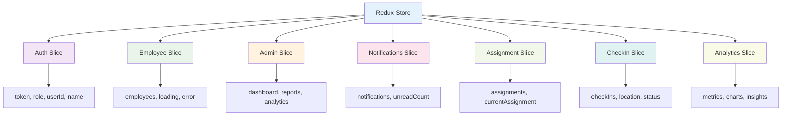
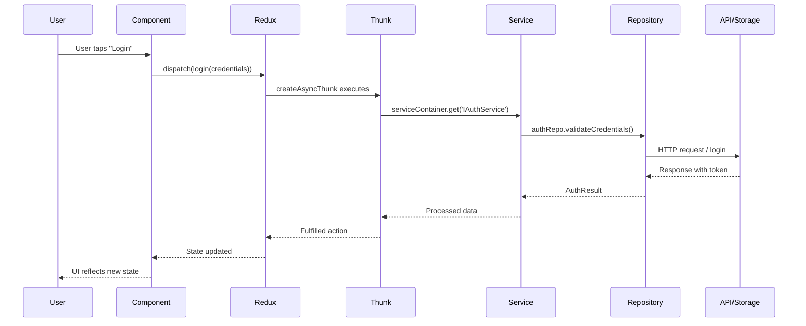
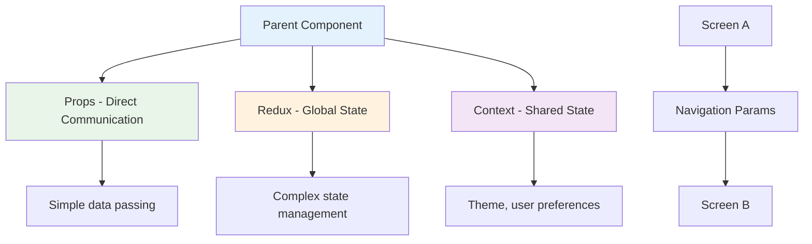
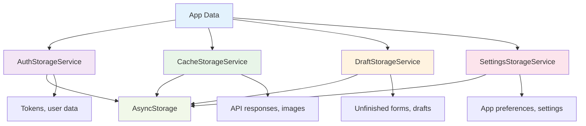
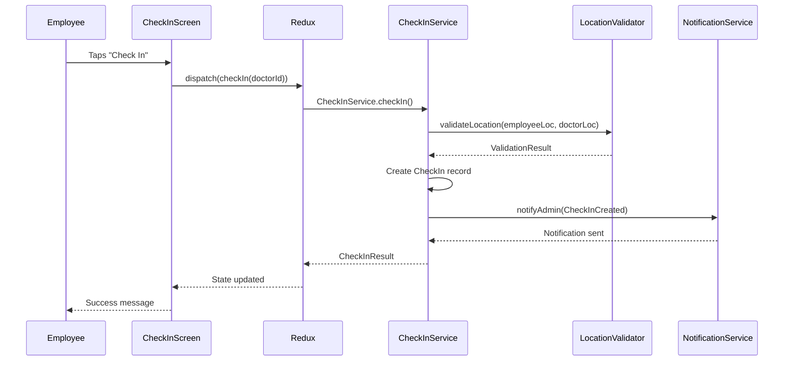

# Ayska Field App - Data Flow Guide

## 🌊 Overview

Understanding data flow in our app is like **following a river from its source to the ocean**. Data starts from user interactions, flows through various layers, and eventually reaches storage or external APIs. This guide will help you navigate this journey.

## 🏪 Redux State Management

### Store Structure

Think of our Redux store as a **central warehouse** where all app data is stored and managed:



### createAsyncThunk Pattern

Our async operations follow a **restaurant order system** - you place an order (dispatch), the kitchen prepares it (thunk), and you get your food (fulfilled/rejected):

```typescript
// Like placing an order at a restaurant
export const fetchEmployees = createAsyncThunk<
  Employee[], // What you expect to receive
  void, // What you're sending
  { state: RootState; extra: { serviceContainer: ServiceContainer } }
>('employees/fetchEmployees', async (_, thunkAPI) => {
  // The kitchen (service) prepares your order
  const employeeService =
    thunkAPI.extra.serviceContainer.get('IEmployeeService');
  return employeeService.getEmployees();
});
```

### Selectors

Selectors are like **smart assistants** that know exactly where to find what you need:

```typescript
// Like asking "Where are the red apples?"
export const selectEmployees = (state: RootState) =>
  state.employee?.employees ?? [];
export const selectLoading = (state: RootState) =>
  state.employee?.loading ?? false;
export const selectError = (state: RootState) => state.employee?.error ?? null;
```

## 🔄 Data Flow Patterns

### Complete Data Journey

Think of data flow like a **postal service** - data travels through multiple stations before reaching its destination:



### Component Communication

Our components communicate like **neighbors in a friendly neighborhood**:



**When to use what:**

- **Props**: Simple parent-child communication (like passing a note to your neighbor)
- **Redux**: Complex state that multiple components need (like a community bulletin board)
- **Context**: App-wide settings like theme (like the neighborhood's shared utilities)

## 🏗️ Service Container & Dependency Injection

### Service Registration

Our ServiceContainer is like a **smart vending machine** - you ask for what you need, and it gives you the right service:

```typescript
// Like stocking a vending machine
this.registerSingleton(
  'IAuthStorage',
  () => new AuthStorageService(this.get('IStorageProvider'))
);

// Like getting a snack from the vending machine
const authStorage = serviceContainer.get('IAuthStorage');
```

### Singleton vs Factory

Think of services like **utilities in your house**:

- **Singleton**: Like your water heater - one instance serves the whole house
- **Factory**: Like light bulbs - you need a new one each time

```typescript
// Singleton: One instance for the whole app
this.registerSingleton('IAuthStorage', () => new AuthStorageService());

// Factory: New instance each time
this.registerFactory('IHttpClient', () => {
  const client = new HttpClient();
  client.addInterceptor(new AuthInterceptor());
  return client;
});
```

### Getting Services in Thunks

In Redux thunks, we get services like **calling a specialist**:

```typescript
export const fetchData = createAsyncThunk(
  'slice/fetchData',
  async (payload, thunkAPI) => {
    // Like calling a specialist
    const service = thunkAPI.extra.serviceContainer.get('IServiceName');
    return service.getData(payload);
  }
);
```

## 💾 Data Persistence

### Storage Architecture

Our storage system is like a **multi-level filing cabinet**:



### When Data Persists

Think of data persistence like **different types of memory**:

- **AuthStorageService**: Like your ID card - always with you, secure
- **CacheStorageService**: Like a notebook - temporary, can be thrown away
- **DraftStorageService**: Like a sticky note - temporary, but important while working
- **SettingsStorageService**: Like your preferences - saved until you change them

```typescript
// Data that persists (like your ID)
await authStorage.saveToken(token);

// Data that's temporary (like a shopping list)
await cacheStorage.setItem('employees', employees);

// Data that's temporary but important (like a draft email)
await draftStorage.saveDraft('assignment', assignmentData);
```

## 🔄 Real-World Examples

### Login Flow

Let's trace a **login journey** like following a package through the postal system:

```mermaid
graph TD
    A[User enters credentials] --> B[LoginScreen]
    B --> C[dispatch(login(credentials))]
    C --> D[authSlice.login thunk]
    D --> E[serviceContainer.get('IAuthService')]
    E --> F[AuthService.login()]
    F --> G[AuthRepository.validateCredentials()]
    G --> H[HTTP request to API]
    H --> I[API responds with token]
    I --> J[AuthService processes response]
    J --> K[thunk returns AuthResult]
    K --> L[authSlice.fulfilled reducer]
    L --> M[Redux state updated]
    M --> N[LoginScreen re-renders]
    N --> O[User sees success/error]

    style A fill:#e3f2fd
    style B fill:#f3e5f5
    style C fill:#e8f5e8
    style D fill:#fff3e0
    style E fill:#fce4ec
    style F fill:#f1f8e9
    style G fill:#e0f2f1
    style H fill:#f9fbe7
    style I fill:#e1f5fe
    style J fill:#f3e5f5
    style K fill:#e8f5e8
    style L fill:#fff3e0
    style M fill:#fce4ec
    style N fill:#f1f8e9
    style O fill:#e0f2f1
```

### Check-in Flow

The check-in process is like **visiting a doctor's office** - multiple steps with validation:



### Employee List Flow

Loading employee data is like **organizing a team meeting** - you need to gather everyone:

```mermaid
graph TD
    A[AdminDashboard loads] --> B[useEffect triggers]
    B --> C[dispatch(fetchEmployees)]
    C --> D[employeeSlice.fetchEmployees thunk]
    D --> E[serviceContainer.get('IEmployeeService')]
    E --> F[EmployeeService.getEmployees()]
    F --> G[EmployeeRepository.getAll()]
    G --> H[LocalDataRepository.getAll('employees')]
    H --> I[Returns cached data]
    I --> J[EmployeeService processes data]
    J --> K[thunk returns Employee[]]
    K --> L[employeeSlice.fulfilled reducer]
    L --> M[Redux state: employees = data]
    M --> N[AdminDashboard re-renders]
    N --> O[EmployeeList displays data]

    style A fill:#e3f2fd
    style B fill:#f3e5f5
    style C fill:#e8f5e8
    style D fill:#fff3e0
    style E fill:#fce4ec
    style F fill:#f1f8e9
    style G fill:#e0f2f1
    style H fill:#f9fbe7
    style I fill:#e1f5fe
    style J fill:#f3e5f5
    style K fill:#e8f5e8
    style L fill:#fff3e0
    style M fill:#fce4ec
    style N fill:#f1f8e9
    style O fill:#e0f2f1
```

## 🎯 Key Data Flow Principles

### 1. Unidirectional Flow

Data flows in **one direction** like a river - from user interaction to storage:

```
User → Component → Redux → Service → Repository → Storage/API
```

### 2. Single Source of Truth

Redux store is the **single source of truth** - like a master record book:

```typescript
// ✅ Good: Get data from Redux
const employees = useSelector(selectEmployees);

// ❌ Bad: Store data in component state
const [employees, setEmployees] = useState([]);
```

### 3. Predictable State Updates

State changes follow **clear patterns** - like following a recipe:

```typescript
// 1. User action
dispatch(login(credentials));

// 2. Async operation
const result = await authService.login(credentials);

// 3. State update
state.token = result.token;
state.user = result.user;
```

## 🚨 Common Data Flow Mistakes

### 1. Bypassing Redux

```typescript
// ❌ Bad: Direct service calls in components
const handleLogin = async () => {
  const authService = serviceContainer.get('IAuthService');
  const result = await authService.login(credentials);
  // State not updated in Redux!
};

// ✅ Good: Use Redux thunks
const handleLogin = () => {
  dispatch(login(credentials));
};
```

### 2. Storing Business Logic in Components

```typescript
// ❌ Bad: Business logic in component
const LoginScreen = () => {
  const validateCredentials = (email, password) => {
    // Validation logic here
  };
};

// ✅ Good: Business logic in service
const LoginScreen = () => {
  const authService = serviceContainer.get('IAuthService');
  // Service handles validation
};
```

### 3. Not Handling Loading States

```typescript
// ❌ Bad: No loading state
const employees = useSelector(selectEmployees);

// ✅ Good: Handle loading state
const employees = useSelector(selectEmployees);
const loading = useSelector(selectLoading);
const error = useSelector(selectError);
```

## 🔗 Next Steps

- Check the [UI Best Practices](./ui-best-practices.md) for component data handling
- Review the [Design Patterns Guide](./design-patterns-guide.md) for architectural patterns
- Read the [Project Setup Guide](./project-setup-guide.md) for development environment

---

**Remember**: Data flow is like water flowing through pipes - it needs clear channels, proper valves (validation), and a destination (storage). Follow the patterns, and your data will flow smoothly! 🌊
