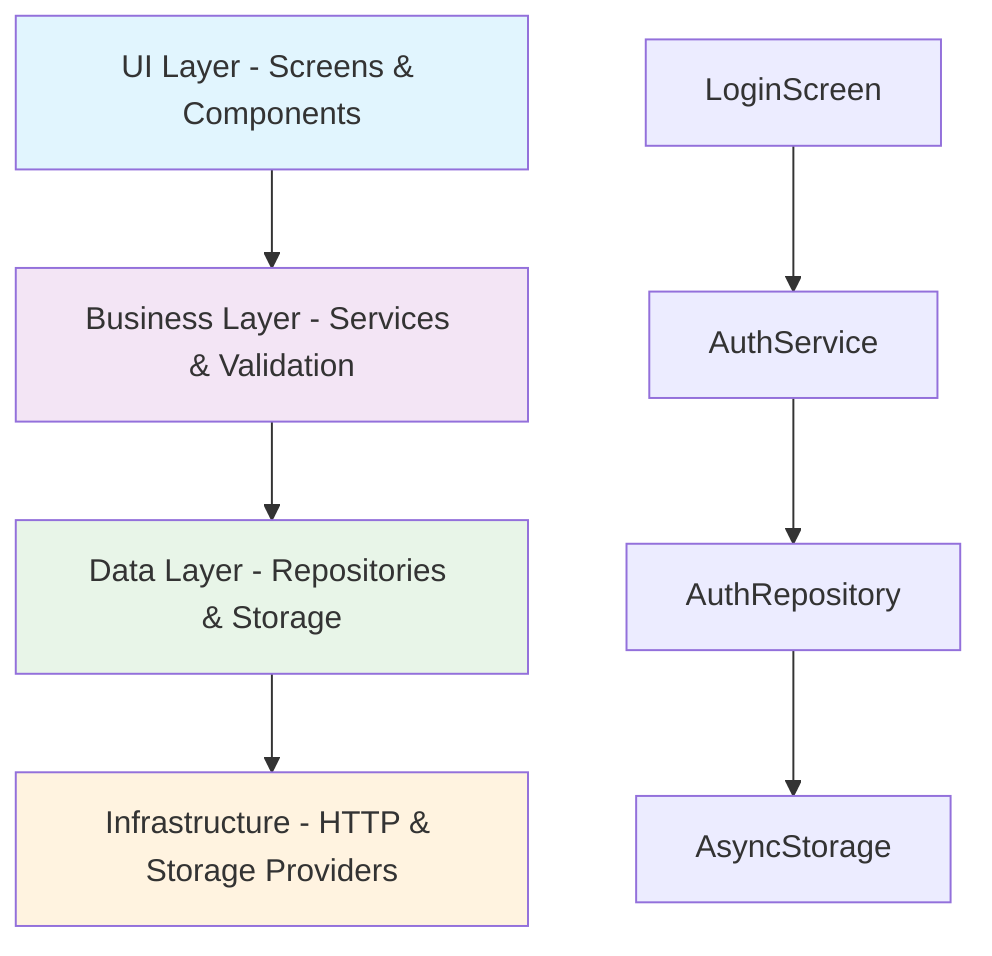
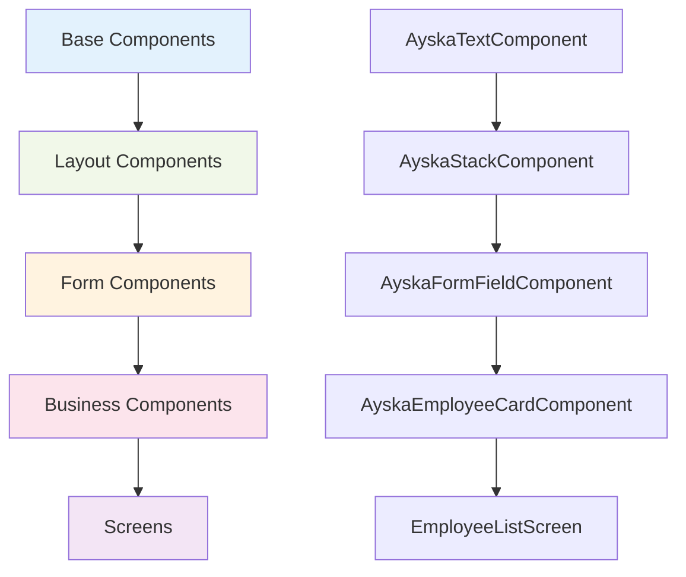

# Ayska Field App - Developer Guide

## 🎯 Overview

Welcome to the Ayska Field App! This guide will help you understand the project architecture, development workflow, and best practices. Think of this app as a **well-organized city** where each district has a specific purpose, and there are clear rules for how they interact.

## 🏗️ Architecture Principles

### SOLID Principles in Action

Our app follows SOLID principles like a **restaurant kitchen** - each chef has one specialty, ingredients are prepared separately, and everything comes together harmoniously.

#### 1. Single Responsibility Principle

Each class/function has ONE clear job:

```typescript
// ✅ Good: One responsibility
class AuthRepository {
  async saveToken(token: string) {
    /* only handles token storage */
  }
}

// ❌ Bad: Multiple responsibilities
class AuthRepository {
  async saveToken(token: string) {
    /* token storage */
  }
  async validateEmail(email: string) {
    /* validation logic */
  }
  async sendEmail() {
    /* email sending */
  }
}
```

#### 2. Dependency Inversion Principle

Depend on abstractions, not concrete implementations:

```typescript
// ✅ Good: Depends on interface
class AuthService {
  constructor(private authRepo: IAuthRepository) {}
}

// ❌ Bad: Depends on concrete class
class AuthService {
  constructor(private authRepo: AuthRepository) {}
}
```

### Separation of Concerns

Our architecture has **three distinct layers**, like a **three-story building**:



**Layer Responsibilities:**

- **UI Layer**: Pure presentation, no business logic
- **Business Layer**: Validation, state management, business rules
- **Data Layer**: API calls, data persistence, external integrations

## 📁 Project Structure

### Directory Organization

Our project structure is like a **well-organized library** - everything has its place:

```
src/
├── interfaces/          # 📋 Contracts (what services promise to do)
├── repositories/        # 🗄️ Data access (how we get/save data)
├── services/           # 🧠 Business logic (what the app does)
├── components/         # 🎨 UI building blocks
├── store/             # 🏪 State management (app's memory)
├── validation/        # ✅ Rules and checks
└── di/                # 🔧 Dependency injection (service registry)
```

### File Naming Conventions

Think of our naming like **street signs** - they tell you exactly what you'll find:

- **Interfaces**: `I*` prefix (IAuthRepository, IStorageProvider)
- **Services**: `*Service` suffix (AuthService, EmployeeService)
- **Repositories**: `*Repository` suffix (AuthRepository, EmployeeRepository)
- **Components**: `Ayska*Component` (AyskaTextComponent, AyskaButtonComponent)

## 🚀 Development Workflow

### Setting Up Your Environment

1. **Prerequisites** (like getting your driver's license):

   ```bash
   # Check Node.js version (18+)
   node --version

   # Install Expo CLI
   npm install -g @expo/cli
   ```

2. **Initial Setup** (like moving into a new house):

   ```bash
   # Clone and install
   git clone <repository>
   cd ayska-field-app
   npm install

   # iOS setup (if on macOS)
   cd ios && pod install && cd ..
   ```

3. **Running the App** (like starting your car):

   ```bash
   # Development server
   npm start

   # Platform-specific
   npm run ios      # iOS simulator
   npm run android  # Android emulator
   npm run web      # Web browser
   ```

### Development Tools

Our tools are like a **mechanic's toolkit** - each has a specific purpose:

```bash
# Code quality (like a spell-checker)
npm run lint           # Check for issues
npm run lint:fix       # Auto-fix issues
npm run type-check     # TypeScript validation

# Testing (like quality control)
npm test               # Run all tests
npm run test:watch     # Watch mode
npm test -- --coverage # Coverage report

# Maintenance (like housekeeping)
npm run check-duplicates  # Find duplicate code
npm run reset-project     # Clean slate
```

## 🎨 Code Style & Standards

### TypeScript Best Practices

Think of TypeScript like **GPS navigation** - it guides you to the right destination:

```typescript
// ✅ Good: Clear types
interface User {
  id: string;
  name: string;
  email: string;
}

// ✅ Good: Proper typing
const handleLogin = async (
  credentials: LoginCredentials
): Promise<AuthResult> => {
  // Implementation
};

// ❌ Bad: Any types (like driving without GPS)
const handleLogin = async (credentials: any): Promise<any> => {
  // Implementation
};
```

### ESLint Rules

Our linter is like a **traffic cop** - it enforces the rules:

- **Unused imports**: Remove unused code (like cleaning your room)
- **Consistent naming**: Follow our conventions (like following street signs)
- **Type safety**: Use proper TypeScript (like wearing a seatbelt)

## 🧪 Testing Strategy

### Test Coverage Requirements

We maintain **80% test coverage** - like having insurance for 80% of your car's value:

```typescript
// Example test structure
describe('AuthService', () => {
  it('should login with valid credentials', async () => {
    // Arrange
    const mockRepo = jest.fn();
    const service = new AuthService(mockRepo);

    // Act
    const result = await service.login('user@example.com', 'password');

    // Assert
    expect(result.success).toBe(true);
  });
});
```

### Testing Patterns

- **Unit Tests**: Test individual functions (like testing each car part)
- **Integration Tests**: Test component interactions (like testing how parts work together)
- **Theme Tests**: Ensure components work in light/dark modes (like testing in different weather)

## 🔧 Common Tasks

### Adding a New Feature

Think of this like **building a new room in your house**:

1. **Plan the Interface** (draw the blueprint):

   ```typescript
   // src/interfaces/AyskaServicesInterface.ts
   export interface ITeamsService {
     getTeams(): Promise<Team[]>;
     createTeam(team: Team): Promise<Team>;
   }
   ```

2. **Create the Repository** (lay the foundation):

   ```typescript
   // src/repositories/AyskaTeamsRepositoryRepository.ts
   export class TeamsRepository implements ITeamsRepository {
     constructor(private dataRepo: LocalDataRepository<any>) {}

     async getTeams(): Promise<Team[]> {
       return this.dataRepo.getAll('teams');
     }
   }
   ```

3. **Register the Service** (connect utilities):

   ```typescript
   // src/di/ServiceContainer.ts
   this.registerSingleton(
     'ITeamsRepository',
     () => new TeamsRepository(this.get('IDataRepository'))
   );
   ```

4. **Create Redux Slice** (add to the app's memory):

   ```typescript
   // src/store/slices/AyskaTeamsSliceSlice.ts
   export const fetchTeams = createAsyncThunk(
     'teams/fetchTeams',
     async (_, thunkAPI) => {
       const repo = thunkAPI.extra.serviceContainer.get('ITeamsRepository');
       return repo.getTeams();
     }
   );
   ```

5. **Build UI Components** (furnish the room):
   ```typescript
   // src/components/business/AyskaTeamCardComponent.tsx
   export const TeamCard: React.FC<TeamCardProps> = ({ team }) => {
     return (
       <AyskaContainerComponent>
         <AyskaTitleComponent>{team.name}</AyskaTitleComponent>
       </AyskaContainerComponent>
     );
   };
   ```

### Creating New Components

Follow the **component hierarchy** (like building with LEGO blocks):



## 🚨 Common Pitfalls

### Anti-Patterns to Avoid

1. **Direct Instantiation** (like building your own car instead of buying one):

   ```typescript
   // ❌ Bad
   const authRepo = new AuthRepository(dataRepo);

   // ✅ Good
   const authRepo = serviceContainer.get('IAuthRepository');
   ```

2. **Business Logic in Components** (like cooking in the living room):

   ```typescript
   // ❌ Bad
   const LoginScreen = () => {
     const validateEmail = email => {
       /* validation logic */
     };
     // ...
   };

   // ✅ Good
   const LoginScreen = () => {
     const authService = serviceContainer.get('IAuthService');
     // ...
   };
   ```

3. **Hardcoded Values** (like writing directions in permanent marker):

   ```typescript
   // ❌ Bad
   <Text color="#FF0000">Error</Text>

   // ✅ Good
   <AyskaTextComponent color="error">Error</AyskaTextComponent>
   ```

## 🎯 Key Takeaways

1. **Follow the Architecture**: Each layer has a specific purpose
2. **Use Dependency Injection**: Never instantiate services directly
3. **Write Tests**: Maintain 80% coverage
4. **Follow Naming Conventions**: Use I* for interfaces, *Service for services
5. **Keep Components Pure**: No business logic in UI components
6. **Use the UI Library**: Leverage Ayska components for consistency

## 🔗 Next Steps

- Read the [Data Flow Guide](./data-flow-guide.md) to understand how data moves through the app
- Check the [UI Best Practices](./ui-best-practices.md) for component guidelines
- Review the [Design Patterns Guide](./design-patterns-guide.md) for architectural patterns

---

**Remember**: This app is like a well-oiled machine - every part has its place and purpose. Follow the patterns, and you'll build features that fit seamlessly into the existing architecture! 🚀
