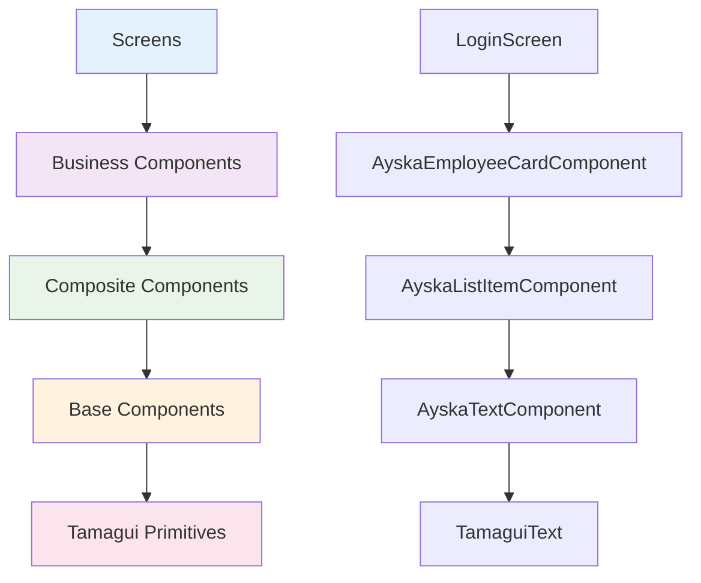

# Ayska Field App - UI Best Practices

## 🎨 Overview

Building great UI is like **crafting a beautiful piece of furniture** - it needs to be functional, beautiful, and built to last. This guide covers our component architecture, theming system, and best practices for creating consistent, accessible, and performant interfaces.

## 🏗️ Component Architecture

### Component Hierarchy

Our components are organized like a **Russian nesting doll** - each layer contains and supports the next:



### Component Responsibility Matrix

Think of components like **different types of workers** in a company:

| Component Type          | UI Logic                | Business Logic    | Data Access      | Example                      |
| ----------------------- | ----------------------- | ----------------- | ---------------- | ---------------------------- |
| **Base Components**     | ✅ Styling, rendering   | ❌ None           | ❌ None          | `AyskaTextComponent`         |
| **Layout Components**   | ✅ Positioning, spacing | ❌ None           | ❌ None          | `AyskaStackComponent`        |
| **Form Components**     | ✅ Input handling       | ✅ Validation     | ❌ None          | `AyskaFormFieldComponent`    |
| **Business Components** | ✅ Display logic        | ✅ Business rules | ✅ Service calls | `AyskaEmployeeCardComponent` |

### When to Create New Components

Follow the **"Rule of Three"** - like a good chef who knows when to create a new recipe:

- **Create new component** when you use the same UI pattern 3+ times
- **Reuse existing** when the pattern is used 1-2 times
- **Extend existing** when you need slight variations

```typescript
// ✅ Good: Reuse existing component
<AyskaTextComponent variant="body" color="text">
  Employee Name
</AyskaTextComponent>

// ✅ Good: Create new when pattern repeats
<AyskaEmployeeCardComponent
  employee={employee}
  onPress={handleEmployeePress}
/>

// ❌ Bad: Duplicate existing patterns
<div>
  <Text style={customStyle}>Employee Name</Text>
  <Text style={customStyle}>Employee Role</Text>
</div>
```

## 🎨 Ayska UI Library

### Available Components

Our UI library is like a **well-stocked toolbox** - each tool has a specific purpose:

#### Base Components (7)

```typescript
// Typography foundation
<AyskaTextComponent variant="body" weight="medium">
  Main content text
</AyskaTextComponent>

<AyskaTitleComponent level={2} weight="bold">
  Section heading
</AyskaTitleComponent>

<AyskaHeadingComponent variant="section">
  List header
</AyskaHeadingComponent>

// Visual elements
<AyskaIconComponent name="person" size="md" />
<AyskaBadgeComponent variant="success">Active</AyskaBadgeComponent>
```

#### Layout Components (3)

```typescript
// Flexible layouts
<AyskaStackComponent direction="row" spacing="md">
  <AyskaTextComponent>Item 1</AyskaTextComponent>
  <AyskaTextComponent>Item 2</AyskaTextComponent>
</AyskaStackComponent>

<AyskaGridComponent columns={2} gap="md">
  <AyskaTextComponent>Grid Item 1</AyskaTextComponent>
  <AyskaTextComponent>Grid Item 2</AyskaTextComponent>
</AyskaGridComponent>

<AyskaContainerComponent maxWidth="lg" padding="md">
  <AyskaTextComponent>Page content</AyskaTextComponent>
</AyskaContainerComponent>
```

#### Action Components (2)

```typescript
// Interactive elements
<AyskaActionButtonComponent
  variant="primary"
  onPress={handlePress}
  loading={isLoading}
>
  Submit
</AyskaActionButtonComponent>

<AyskaListItemComponent
  title="Employee Name"
  subtitle="Software Engineer"
  onPress={handlePress}
  avatar={{ uri: 'https://...' }}
/>
```

#### Form Components (2)

```typescript
// Form inputs
<AyskaFormFieldComponent
  label="Email"
  placeholder="Enter your email"
  value={email}
  onChangeText={setEmail}
  error={emailError}
  required
/>

<AyskaSearchBarComponent
  placeholder="Search employees..."
  value={searchQuery}
  onChangeText={setSearchQuery}
  onClear={handleClear}
/>
```

#### Feedback Components (4)

```typescript
// Status indicators
<AyskaStatusIndicatorComponent
  type="success"
  message="Login successful"
  dismissible
/>

<AyskaToastComponent
  message="Data saved successfully"
  type="success"
  duration={3000}
/>

<AyskaLoadingStateComponent
  variant="spinner"
  message="Loading employees..."
/>

<AyskaEmptyStateComponent
  icon="people-outline"
  title="No employees found"
  message="Try adjusting your search criteria"
  actionLabel="Add Employee"
  onAction={handleAddEmployee}
/>
```

### Theme Support

Our theming system is like a **smart lighting system** - it automatically adjusts to the environment:

```typescript
// Automatic theme switching
const theme = useTheme();
// Light: { text: '#1E293B', background: '#F9FAFB' }
// Dark:  { text: '#F1F5F9', background: '#0F172A' }

// Theme-aware components
<AyskaTextComponent color="text">Always readable</AyskaTextComponent>
<AyskaTextComponent color="primary">Brand color</AyskaTextComponent>
<AyskaTextComponent color="error">Error state</AyskaTextComponent>
```

### Typography System

Our typography is like a **well-organized library** - each book has its place:

```typescript
// Text variants (like book categories)
<AyskaTextComponent variant="body">Regular content</AyskaTextComponent>
<AyskaTextComponent variant="bodyLarge">Important content</AyskaTextComponent>
<AyskaTextComponent variant="bodySmall">Secondary content</AyskaTextComponent>

// Text weights (like book importance)
<AyskaTextComponent weight="normal">Regular text</AyskaTextComponent>
<AyskaTextComponent weight="medium">Emphasized text</AyskaTextComponent>
<AyskaTextComponent weight="semibold">Important text</AyskaTextComponent>
<AyskaTextComponent weight="bold">Critical text</AyskaTextComponent>

// Title levels (like document hierarchy)
<AyskaTitleComponent level={1}>Page title</AyskaTitleComponent>
<AyskaTitleComponent level={2}>Section title</AyskaTitleComponent>
<AyskaTitleComponent level={3}>Subsection title</AyskaTitleComponent>
<AyskaTitleComponent level={4}>Card title</AyskaTitleComponent>
```

### Spacing System

Our spacing system is like a **musical scale** - consistent intervals create harmony:

```typescript
// Semantic spacing (like musical notes)
const Spacing = {
  xs: 4,   // 16th note - micro spacing
  sm: 8,   // 8th note - small spacing
  md: 16,  // Quarter note - medium spacing
  lg: 24,  // Half note - large spacing
  xl: 32,  // Whole note - extra large spacing
  xxl: 48, // Double whole - maximum spacing
};

// Usage in components
<AyskaStackComponent spacing="md">
  <AyskaTextComponent>Item 1</AyskaTextComponent>
  <AyskaTextComponent>Item 2</AyskaTextComponent>
</AyskaStackComponent>
```

## 🎨 Styling Guidelines

### Using Tamagui Components

Think of Tamagui like **high-quality building materials** - they provide the foundation, but you need to use them correctly:

```typescript
// ✅ Good: Use Tamagui props
<AyskaStackComponent
  direction="row"
  alignItems="center"
  justifyContent="space-between"
  padding="md"
  backgroundColor="background"
>
  <AyskaTextComponent>Content</AyskaTextComponent>
</AyskaStackComponent>

// ❌ Bad: Custom styles override
<AyskaStackComponent style={{ padding: 20, backgroundColor: '#fff' }}>
  <AyskaTextComponent>Content</AyskaTextComponent>
</AyskaStackComponent>
```

### Theme-Aware Styling

Never hardcode colors - it's like **painting your house without considering the lighting**:

```typescript
// ✅ Good: Theme-aware colors
<AyskaTextComponent color="text">Always readable</AyskaTextComponent>
<AyskaTextComponent color="primary">Brand consistent</AyskaTextComponent>

// ❌ Bad: Hardcoded colors
<AyskaTextComponent style={{ color: '#000000' }}>Breaks in dark mode</AyskaTextComponent>
```

### Responsive Design

Our responsive design is like a **flexible furniture system** - it adapts to different spaces:

```typescript
// Responsive grid (like adjustable shelves)
<AyskaGridComponent
  columns={{ xs: 1, sm: 2, md: 3, lg: 4 }}
  gap="md"
>
  {employees.map(employee => (
    <AyskaEmployeeCardComponent key={employee.id} employee={employee} />
  ))}
</AyskaGridComponent>

// Responsive spacing (like adjustable table height)
<AyskaStackComponent
  padding={{ xs: "sm", md: "lg" }}
  spacing={{ xs: "sm", md: "md" }}
>
  <AyskaTextComponent>Content</AyskaTextComponent>
</AyskaStackComponent>
```

### Platform-Specific Code

Handle platform differences like **customizing a car for different terrains**:

```typescript
import { Platform } from 'react-native';

// Platform-specific styling
<AyskaActionButtonComponent
  style={{
    ...Platform.select({
      ios: { shadowColor: '#000', shadowOffset: { width: 0, height: 2 } },
      android: { elevation: 4 }
    })
  }}
>
  Platform-specific button
</AyskaActionButtonComponent>
```

## ♿ Accessibility

### Using getA11yProps Utility

Accessibility is like **building ramps alongside stairs** - everyone should be able to use the app:

```typescript
// ✅ Good: Proper accessibility
<AyskaActionButtonComponent
  onPress={handlePress}
  accessibilityLabel="Login button"
  accessibilityHint="Double tap to log in to your account"
  accessibilityRole="button"
>
  Login
</AyskaActionButtonComponent>

// ❌ Bad: Missing accessibility
<AyskaActionButtonComponent onPress={handlePress}>
  Login
</AyskaActionButtonComponent>
```

### Screen Reader Support

Make your components **screen reader friendly** like a good audiobook:

```typescript
// Form fields with proper labels
<AyskaFormFieldComponent
  label="Email Address"
  placeholder="Enter your email"
  value={email}
  onChangeText={setEmail}
  accessibilityLabel="Email address input"
  accessibilityHint="Enter your email address to log in"
/>

// Lists with proper structure
<AyskaStackComponent accessibilityRole="list">
  {employees.map(employee => (
    <AyskaListItemComponent
      key={employee.id}
      title={employee.name}
      subtitle={employee.role}
      accessibilityRole="listitem"
      accessibilityLabel={`${employee.name}, ${employee.role}`}
    />
  ))}
</AyskaStackComponent>
```

### Keyboard Navigation

Support keyboard navigation like **ensuring all doors have handles**:

```typescript
// Focusable elements
<AyskaActionButtonComponent
  onPress={handlePress}
  accessible={true}
  focusable={true}
>
  Submit
</AyskaActionButtonComponent>

// Form navigation
<AyskaFormFieldComponent
  label="Password"
  value={password}
  onChangeText={setPassword}
  returnKeyType="next"
  onSubmitEditing={handleNext}
/>
```

## ⚡ Performance

### React.memo for Expensive Components

Use React.memo like **insulating your house** - it prevents unnecessary re-renders:

```typescript
// ✅ Good: Memoize expensive components
export const AyskaEmployeeCardComponent = React.memo<EmployeeCardProps>(({
  employee,
  onPress
}) => {
  return (
    <AyskaContainerComponent onPress={onPress}>
      <AyskaTextComponent>{employee.name}</AyskaTextComponent>
      <AyskaTextComponent>{employee.role}</AyskaTextComponent>
    </AyskaContainerComponent>
  );
});

// ❌ Bad: Re-renders on every parent update
export const AyskaEmployeeCardComponent = ({ employee, onPress }) => {
  // Component logic
};
```

### useCallback for Event Handlers

Use useCallback like **keeping your tools organized** - it prevents unnecessary re-creations:

```typescript
// ✅ Good: Memoized event handlers
const handleEmployeePress = useCallback(
  (employee: Employee) => {
    navigation.navigate('EmployeeDetail', { employeeId: employee.id });
  },
  [navigation]
);

// ❌ Bad: New function on every render
const handleEmployeePress = (employee: Employee) => {
  navigation.navigate('EmployeeDetail', { employeeId: employee.id });
};
```

### useMemo for Calculations

Use useMemo like **caching expensive calculations** - it stores results for reuse:

```typescript
// ✅ Good: Memoized calculations
const filteredEmployees = useMemo(() => {
  return employees.filter(emp =>
    emp.name.toLowerCase().includes(searchQuery.toLowerCase())
  );
}, [employees, searchQuery]);

// ❌ Bad: Recalculates on every render
const filteredEmployees = employees.filter(emp =>
  emp.name.toLowerCase().includes(searchQuery.toLowerCase())
);
```

### FlatList vs ScrollView

Choose the right component like **choosing the right vehicle**:

```typescript
// ✅ Good: FlatList for large lists (like a bus for many passengers)
<FlatList
  data={employees}
  renderItem={({ item }) => <AyskaEmployeeCardComponent employee={item} />}
  keyExtractor={item => item.id}
  onEndReached={handleLoadMore}
  onEndReachedThreshold={0.5}
/>

// ✅ Good: ScrollView for small content (like a car for few passengers)
<ScrollView>
  <AyskaTextComponent>Small amount of content</AyskaTextComponent>
</ScrollView>
```

## 🎯 User Experience

### Haptic Feedback

Add haptic feedback like **adding texture to a surface** - it provides tactile confirmation:

```typescript
import { hapticFeedback } from '@/utils/haptics';

// Light feedback for subtle interactions
const handlePress = () => {
  hapticFeedback.light();
  onPress?.();
};

// Medium feedback for important actions
const handleSubmit = () => {
  hapticFeedback.medium();
  onSubmit();
};

// Heavy feedback for critical actions
const handleDelete = () => {
  hapticFeedback.heavy();
  onDelete();
};
```

### Loading States

Handle loading states like **showing progress on a long journey**:

```typescript
// Loading component
<AyskaLoadingStateComponent
  variant="spinner"
  message="Loading employees..."
/>

// Button loading state
<AyskaActionButtonComponent
  loading={isLoading}
  disabled={isLoading}
>
  {isLoading ? 'Saving...' : 'Save'}
</AyskaActionButtonComponent>
```

### Empty States

Handle empty states like **welcoming guests to an empty room**:

```typescript
// Empty state component
<AyskaEmptyStateComponent
  icon="people-outline"
  title="No employees found"
  message="Try adjusting your search criteria or add a new employee"
  actionLabel="Add Employee"
  onAction={handleAddEmployee}
/>
```

### Error Handling

Handle errors like **having a backup plan**:

```typescript
// Error state component
<AyskaStatusIndicatorComponent
  type="error"
  message="Failed to load employees"
  dismissible
  onDismiss={handleDismissError}
/>

// Retry functionality
<AyskaActionButtonComponent
  variant="secondary"
  onPress={handleRetry}
>
  Try Again
</AyskaActionButtonComponent>
```

## 🚨 Common UI Mistakes

### 1. Inconsistent Spacing

```typescript
// ❌ Bad: Inconsistent spacing
<View style={{ margin: 10, padding: 15, gap: 8 }}>

// ✅ Good: Consistent spacing system
<AyskaStackComponent spacing="md" padding="lg">
```

### 2. Hardcoded Colors

```typescript
// ❌ Bad: Hardcoded colors
<Text style={{ color: '#FF0000' }}>Error</Text>

// ✅ Good: Theme-aware colors
<AyskaTextComponent color="error">Error</AyskaTextComponent>
```

### 3. Missing Accessibility

```typescript
// ❌ Bad: No accessibility
<Button onPress={handlePress}>Submit</Button>

// ✅ Good: Proper accessibility
<AyskaActionButtonComponent
  onPress={handlePress}
  accessibilityLabel="Submit form"
  accessibilityHint="Double tap to submit the form"
>
  Submit
</AyskaActionButtonComponent>
```

### 4. Poor Performance

```typescript
// ❌ Bad: Expensive operations in render
const ExpensiveComponent = () => {
  const expensiveData = processLargeDataset(data); // Runs every render!
  return <Text>{expensiveData}</Text>;
};

// ✅ Good: Memoized calculations
const ExpensiveComponent = () => {
  const expensiveData = useMemo(() =>
    processLargeDataset(data), [data]
  );
  return <AyskaTextComponent>{expensiveData}</AyskaTextComponent>;
};
```

## 🎯 Key Takeaways

1. **Use the UI Library**: Leverage Ayska components for consistency
2. **Follow the Hierarchy**: Base → Composite → Business → Screens
3. **Theme Everything**: Never hardcode colors or spacing
4. **Accessibility First**: Use getA11yProps and proper labels
5. **Performance Matters**: Use React.memo, useCallback, useMemo
6. **Handle All States**: Loading, empty, error, success

## 🔗 Next Steps

- Read the [Data Flow Guide](./data-flow-guide.md) to understand component data handling
- Check the [Design Patterns Guide](./design-patterns-guide.md) for architectural patterns
- Review the [Project Setup Guide](./project-setup-guide.md) for development environment

---

**Remember**: Great UI is like a well-designed kitchen - everything has its place, works together harmoniously, and makes the user's job easier! 🎨
